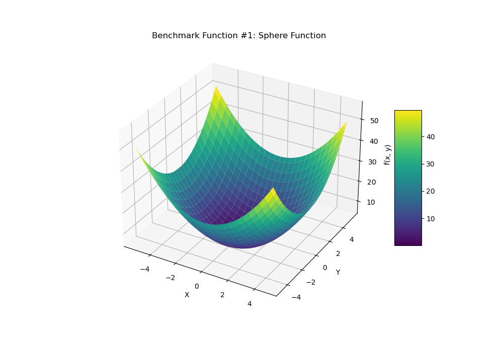
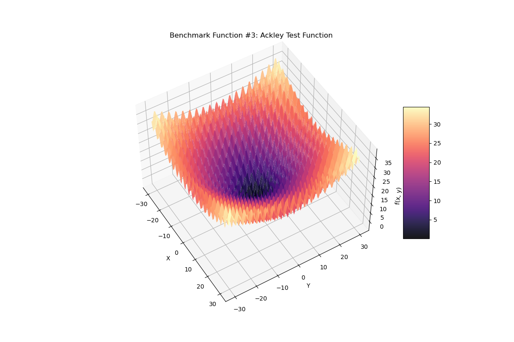
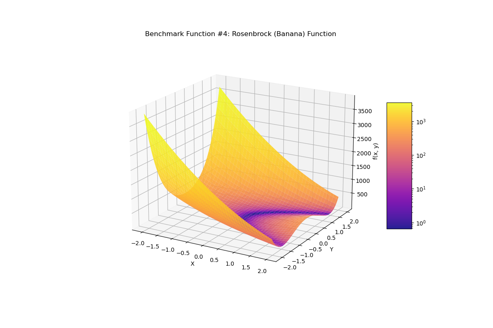
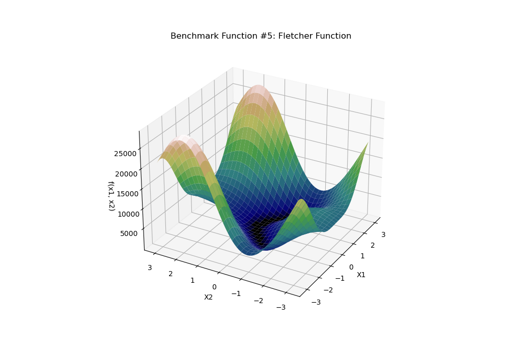
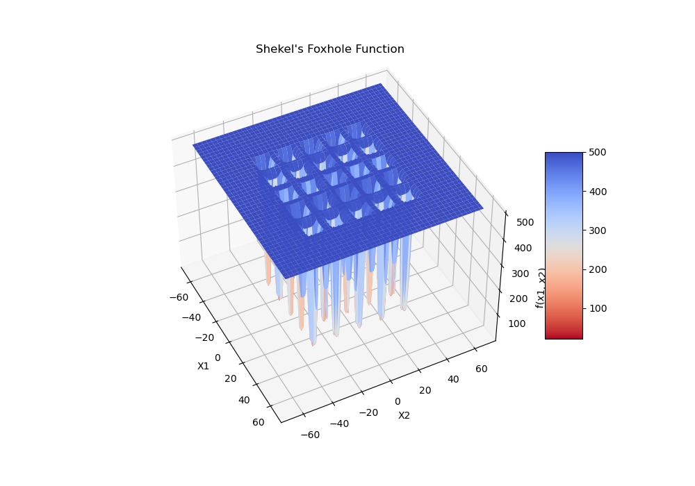
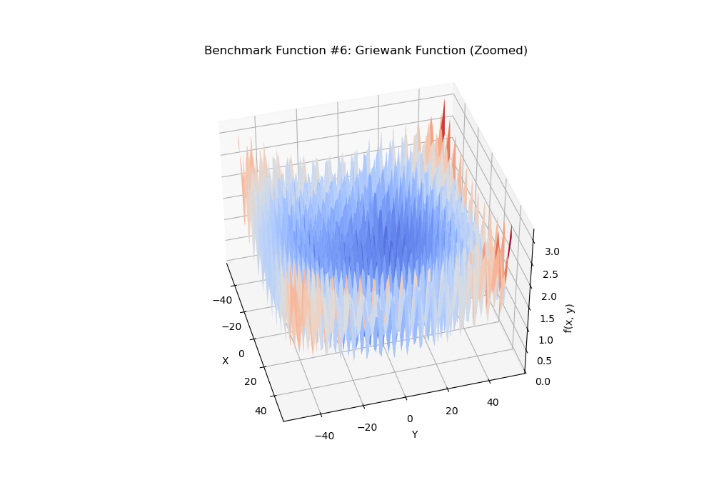
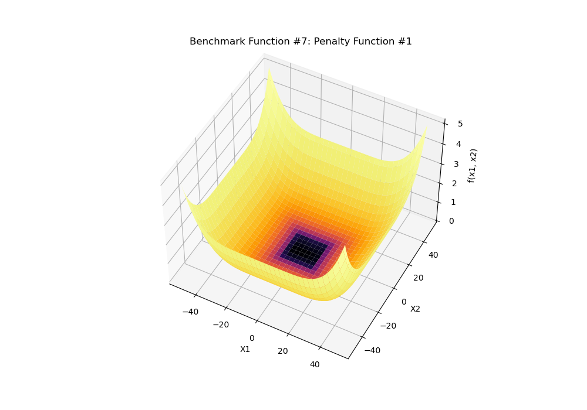
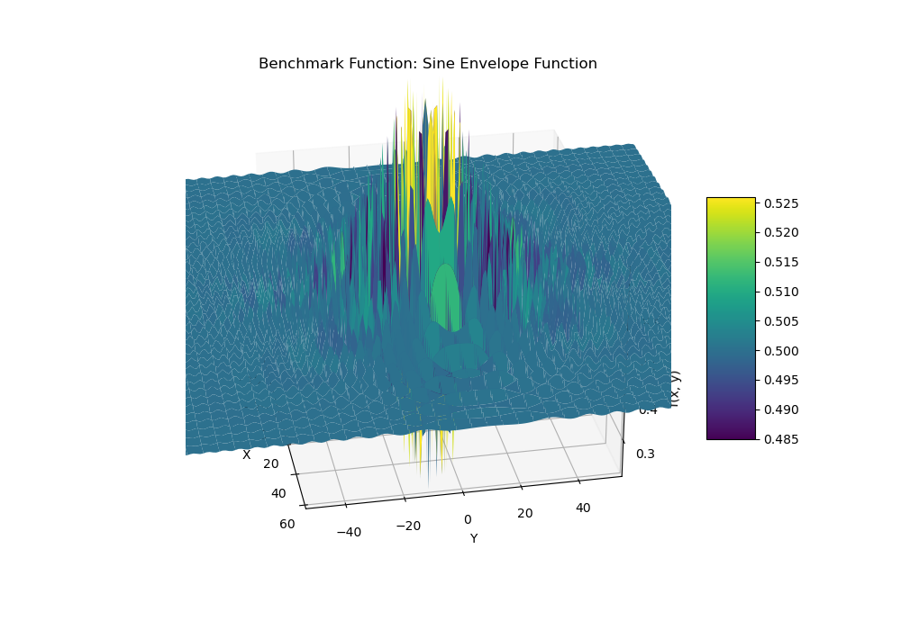
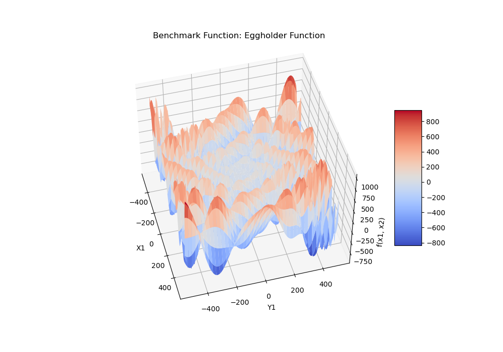

# Benchmark Optimization Functions

This folder contains a small benchmark suite of continuous optimization test functions, all implemented in C++ for two decision variables $(x_1, x_2)$ and visualized as 3‑D surface plots (saved in the Plots subfolder).

The goal of this document is to:

- Precisely define each function (formula and domain).
- Show the corresponding 2‑D surface plot.
- Highlight what aspect of optimization performance the function tests.
- Point out any difficulties or pitfalls when evaluating algorithms on it.

All functions are implemented in the C++ files next to this markdown document and the data for the plots is generated in the corresponding `*_data.csv` files.

---

## 1. Sphere Function

**Source:** sphere.cpp  | **Data:** sphere_data.csv

**Definition (2‑D):**

$$
f_{\text{sphere}}(x_1, x_2) = x_1^2 + x_2^2.
$$

**Domain used in this project:**

$$
x_1, x_2 \in [-5.12, 5.12].
$$

**Global optimum:**

$$
f(0, 0) = 0, \quad \text{unique global minimum at } (0, 0).
$$

**Characteristics and purpose**

- Convex, smooth, and strictly unimodal.
- Separable: each dimension contributes independently ($f = \sum x_i^2$).
- Gradient is linear in $x$, and level sets are concentric circles.

**Why it is useful**

- Serves as the simplest baseline for continuous optimization.
- Good for testing whether an algorithm can converge reliably when the landscape is easy, isotropic, and well‑conditioned.
- Allows validation of step‑size control and convergence criteria without interference from local minima.

**Difficulties / caveats**

- Essentially no local minima; algorithms that perform _only_ well here may fail badly on harder landscapes.
- Very forgiving to poor parameter choices, so it cannot distinguish sophisticated methods from simple ones.

---

## 2. Ackley Function

**Source:** ackley.cpp  | **Data:** ackley_data.csv

**Standard 2‑D definition (as implemented):**

$$
f_{\text{Ackley}}(x_1, x_2) =
20 + e
- 20 \exp\left(-0.2 \sqrt{\frac{x_1^2 + x_2^2}{2}}\right)
- \exp\left(\frac{1}{2} \big(\cos(2\pi x_1) + \cos(2\pi x_2)\big)\right).
$$

**Domain used:**

$$
x_1, x_2 \in [-30, 30].
$$

**Global optimum:**

$$
f(0, 0) = 0.
$$

**Characteristics and purpose**

- Highly multimodal: many regularly spaced local minima created by the cosine terms.
- Non‑convex but still symmetric and centered at the global minimum.
- Outer “almost flat” region with low gradients, surrounded by oscillatory structure near the origin.

**Why it is useful**

- Classic test for global optimization and metaheuristics (e.g., evolutionary algorithms, simulated annealing, PSO).
- Evaluates the ability of an algorithm to escape local minima and explore globally before refining near the optimum.

**Difficulties / caveats**

- Local, purely gradient‑based hill climbers started far away from $(0,0)$ can get trapped in surrounding minima.
- The flat outer region makes progress slow when step sizes shrink too aggressively.
- Performance can be very sensitive to initialization and exploration parameters.

---

## 3. Ackley Test Function (Variant)

**Source:** ackley_test.cpp  | **Data:** ackley_test_data.csv

**Definition (as implemented):**

$$
f_{\text{test}}(x_1, x_2) = 3\big(\cos(2x_1) + \sin(2x_2)\big)
 + e^{-0.2}\sqrt{x_1^2 + x_2^2}.
$$

**Domain used:**

$$
x_1, x_2 \in [-30, 30].
$$

**Characteristics and purpose**

- Not the standard Ackley form; here the trigonometric part dominates, creating ridges and valleys.
- Radial term $e^{-0.2}\sqrt{x_1^2+x_2^2}$ gently increases with distance from the origin.
- Useful as an intermediate difficulty function between the pure Ackley landscape and very irregular functions.

**Why it is useful**

- Tests how algorithms behave on a combination of oscillatory terms and a simple radial growth term.
- Good for checking robustness of step‑size adaptation when gradients change relatively smoothly but local oscillations remain.

**Difficulties / caveats**

- Multiple local extrema due to the sine and cosine structure can trap deterministic local search.
- The true global optimum location is less standard, so analytic comparison requires either grid search or reference runs.

---

## 4. Rosenbrock (Banana) Function

**Source:** rosenbrok.cpp  | **Data:** rosenbrock_data.csv

**Definition (2‑D):**

$$
f_{\text{Rosenbrock}}(x_1, x_2)
 = 100\big(x_2 - x_1^2\big)^2 + (x_1 - 1)^2.
$$

**Domain used:**

$$
x_1, x_2 \in [-2.048, 2.048].
$$

**Global optimum:**

$$
f(1, 1) = 0.
$$

**Characteristics and purpose**

- Famous for its narrow, curved “banana‑shaped” valley.
- Only one global minimum, but gradients near the valley floor are small and the curvature is highly anisotropic.
- Non‑separable and ill‑conditioned; strong coupling between $x_1$ and $x_2$.

**Why it is useful**

- Standard test of local search and gradient‑based algorithms’ ability to follow curved valleys.
- Highlights the need for good step‑size selection, momentum, or second‑order information.

**Difficulties / caveats**

- Algorithms can converge to the valley but then move very slowly along it.
- Simple coordinate‑wise or isotropic step strategies struggle due to the huge difference in curvature directions.

---

## 5. Fletcher Function (Fletcher–Powell Type)

**Source:** fletcher.cpp  | **Data:** fletcher_data.csv

The implementation follows a 2‑dimensional Fletcher–Powell style function with randomly generated parameters.

**Definition (conceptual form):**

For $i = 1,2$ and $j = 1,2$ let $a_{ij}, b_{ij}$ and $\alpha_j$ be constants (randomly drawn once per run). Define

$$
A_i = \sum_{j=1}^{2} \big(a_{ij}\sin \alpha_j + b_{ij}\cos \alpha_j\big), \quad
B_i(x) = \sum_{j=1}^{2} \big(a_{ij}\sin x_j + b_{ij}\cos x_j\big).
$$

Then the function is

$$
f_{\text{Fletcher}}(x_1, x_2) = \sum_{i=1}^{2} \big(A_i - B_i(x)\big)^2.
$$

**Domain used:**

$$
x_1, x_2 \in [-\pi, \pi].
$$

**Characteristics and purpose**

- Strongly multimodal; structure depends on the random parameters $a_{ij}, b_{ij}, \alpha_j$.
- Non‑separable and non‑symmetric; each run can generate a different landscape.
- Can contain many local minima of varying depth.

**Why it is useful**

- Models an unknown rugged objective where the analytical form is not fixed.
- Useful for testing robustness: algorithms should perform reasonably well even when the landscape varies between runs.

**Difficulties / caveats**

- Because parameters are random, the exact global optimum is not analytically fixed.
- Makes comparison between different algorithm configurations harder unless the same random seed is reused.
- Local search heuristics can become trapped in shallow local minima.

---

## 6. Shekel’s Foxhole Function

**Source:** foxhole.cpp  | **Data:** shekel_data.csv

This is the classic Shekel’s Foxhole function, featuring 25 “foxholes” arranged on a grid.

**Definition (2‑D as implemented):**

Let $a_{1j}, a_{2j}$ for $j=1,\dots,25$ be fixed constants forming a $5\times5$ grid scaled by 16. Then

$$
f_{\text{Shekel}}(x_1, x_2) =
\left(0.002 + \sum_{j=1}^{25} \frac{1}{j + (x_1 - a_{1j})^6 + (x_2 - a_{2j})^6}\right)^{-1}.
$$

**Domain used:**

$$
x_1, x_2 \in [-65.536, 65.536].
$$

**Characteristics and purpose**

- Extremely rugged with many sharp local minima located at the foxhole positions.
- Global minimum is located near one of these holes; the rest are strong competitors.

**Why it is useful**

- Stresses global search capabilities and diversity maintenance.
- A challenging test for hill climbing and other local search methods, which can easily settle into a nearby foxhole.

**Difficulties / caveats**

- Very narrow basins of attraction require fine exploration around candidate minima.
- Algorithms with too much exploitation may prematurely converge to a sub‑optimal foxhole.

---

## 7. Griewank Function

**Source:** griewant.cpp  | **Data:** griewank_data.csv

**Definition (2‑D as implemented):**

$$
f_{\text{Griewank}}(x_1, x_2) =
1 + \frac{x_1^2 + x_2^2}{4000}
- \cos(x_1)\cos\left(\frac{x_2}{\sqrt{2}}\right).
$$

**The classical higher‑dimensional form is:**

$$
f(x) = 1 + \frac{1}{4000}\sum_{i=1}^{d} x_i^2 - \prod_{i=1}^{d} \cos\left(\frac{x_i}{\sqrt{i}}\right).
$$

**Domain used for visualization:**

In theory $x_i \in [-600, 600]$, but here the plot is generated for

$$
x_1, x_2 \in [-50, 50]
$$

to highlight the ripples around the origin.

**Global optimum:**

$$
f(0, 0) = 0.
$$

**Characteristics and purpose**

- Infinitely many regularly spaced local minima with slowly increasing amplitude as $\lVert x \rVert$ grows.
- Combination of a simple quadratic term and a cosine product introduces non‑separability.

**Why it is useful**

- Tests scalability: the function’s difficulty grows gradually with dimension.
- Good for algorithms that must balance exploration of many small local minima with exploitation near the global minimum.

**Difficulties / caveats**

- The numerous shallow local minima can confuse greedy local search.
- When step sizes are large, algorithms may “jump over” the fine‑scale ripples and miss the basin of the global optimum.

---

## 8. Penalty Function #1

**Source:** penalty_1.cpp  | **Data:** penalty1_data.csv

**Auxiliary penalty term:**

For constants $a, k, m$ define

$$
u(x_i; a, k, m) =
\begin{cases}
 k(x_i - a)^m, & x_i > a, \\
 k(-x_i - a)^m, & x_i < -a, \\
 0, & \text{otherwise.}
\end{cases}
$$

**Definition (2‑D, as implemented):**

Let

$$
y_i = 1 + \frac{x_i + 1}{4},\quad i=1,2.
$$

Then

$$
\begin{aligned}
f_{\text{Penalty1}}(x_1, x_2)
&= \frac{\pi}{2}\Big[10\sin^2(\pi y_1)
 + (y_1 - 1)^2 \big(1 + 10\sin^2(\pi y_2)\big)
 + (y_2 - 1)^2\Big]\\
&\quad + u(x_1; 10, 100, 4) + u(x_2; 10, 100, 4).
\end{aligned}
$$

**Domain used:**

$$
x_1, x_2 \in [-50, 50].
$$

**Global optimum:**

Located near $(x_1, x_2) = (1, 1)$ in transformed coordinates (the exact point follows the standard Penalty #1 specification).

**Characteristics and purpose**

- Flat bottomed region around the optimum with steep penalty walls outside a central box.
- Periodic sine terms add ripples inside the feasible region.

**Why it is useful**

- Designed to test an algorithm’s handling of constraints via penalty terms.
- Evaluates how methods deal with a mixture of mild oscillations and strong boundary penalties.

**Difficulties / caveats**

- The combination of flat regions and penalties can cause premature convergence if exploration is too weak.
- Algorithms must step carefully near the boundary to avoid very large penalty values.

---

## 9. Sine Envelope (Schaffer‑type) Function

**Source:** sine_envelope.cpp  | **Data:** sine_envelope_data.csv

**Definition (2‑D):**

$$
f_{\text{sine‑env}}(x_1, x_2) =
0.5 + \frac{\sin^2\left(\sqrt{x_1^2 + x_2^2}\right) - 0.5}{\big(0.001(x_1^2 + x_2^2) + 1\big)^2}.
$$

**Domain used:**

$$
x_1, x_2 \in [-100, 100].
$$

**Global optimum:**

$$
f(0, 0) = 0.
$$

**Characteristics and purpose**

- Radial symmetry with a series of concentric ripples whose amplitude decays away from the origin.
- Many local minima and maxima close to each other near the center.

**Why it is useful**

- Evaluates algorithms on landscapes with dense local structure but a clearly defined global minimum.
- Good for studying the trade‑off between exploration radius and fine‑scale exploitation.

**Difficulties / caveats**

- Small missteps near the origin can move the search between neighboring ripples, making convergence noisy.
- Algorithms with large step sizes may oscillate and fail to settle at the true minimum.

---

## 10. Eggholder Function

**Source:** eggholder.cpp  | **Data:** eggholder_data.csv

**Definition (2‑D as implemented):**

$$
\begin{aligned}
f_{\text{Eggholder}}(x_1, x_2) &=
 -(x_2 + 47)\sin\Big(\sqrt{\big|x_2 + \tfrac{x_1}{2} + 47\big|}\Big) \\
&\quad - x_1\sin\Big(\sqrt{\big|x_1 - (x_2 + 47)\big|}\Big).
\end{aligned}
$$

**Domain used:**

$$
x_1, x_2 \in [-512, 512].
$$

**Global optimum (standard specification):**

Approximately $f(512, 404.2319) \approx -959.6407$.

**Characteristics and purpose**

- Extremely rugged, with steep cliffs, deep valleys, and many irregular local minima.
- Strongly non‑separable and non‑symmetric.

**Why it is useful**

- Represents one of the more challenging standard benchmarks for global optimization.
- Good for testing robustness to poor initial conditions and the ability to explore complex landscapes.

**Difficulties / caveats**

- Local search methods easily fall into poor local minima and rarely escape without strong stochasticity.
- Step sizes must balance between exploring large regions and not overshooting narrow valleys.

---

## 11. Summary and Practical Use

Together, these benchmark functions cover a spectrum of difficulty levels and landscape features:

- **Simple convex baseline:** Sphere.
- **Multimodal, symmetric landscapes:** Ackley, Griewank, Sine Envelope.
- **Narrow valleys and ill‑conditioning:** Rosenbrock.
- **Random, rugged structures:** Fletcher (Fletcher–Powell type).
- **Many sharp local minima:** Shekel’s Foxhole, Eggholder.
- **Penalty‑based constrained landscapes:** Penalty Function #1.
- **Custom oscillatory variant:** Ackley test function.

When evaluating optimization algorithms (hill climbing, evolutionary strategies, swarm methods, etc.), it is important to:

- Test on **multiple functions**, not just one, to capture different failure modes.
- Report both the **best fitness found** and **robustness statistics** (variance over many runs) on stochastic landscapes like Fletcher or Eggholder.
- Consider **initialization effects**, especially on multimodal functions with many local minima.
- Use these functions to tune algorithm parameters, but avoid overfitting to a single landscape.

This benchmark set therefore provides a compact but diverse testbed for studying and comparing continuous optimization algorithms.
