# Analysis of the results from Pareto Front and Pareto Set

- **The Pareto Front**: In the $(f_1, f_2)$ plot, you will see a series of red points forming a lower-left boundary. These points are "efficient" because you cannot improve (decrease) $f_1$ without making $f_2$ worse.
- **The Pareto Set**: In the $(x_1, x_2)$ plot, the blue points represent the "recipes" or specific inputs that produced the Pareto front. You will likely notice a pattern, such as the points $(-1, 0), (0, -1), (0, 0),$ etc., depending on the resolution.
- **Dominance**: Points far to the top-right of the $(f_1, f_2)$ space (like $(x_1=10, x_2=10)$) are clearly dominated because there are many other points that have lower values for both $f_1$ and $f_2$.

# How to obtain the Pareto Set

Using the mathematical concept of **Dominance**.

- **The Comparison**: It compares every point $(f_1, f_2)$ against every other point in the dataset.
- **The Rule**: A point is dominated (discarded) if there **exists** another point that is:
  1. At least as good as it in all objectives.
  2. Strictly better than it in at least one objective.
- **The Result**: It returns a "mask" (a list of True/False values) identifying the points that no one else could beat in every category. These are our Pareto Optimal points.

## Visualizing the Results

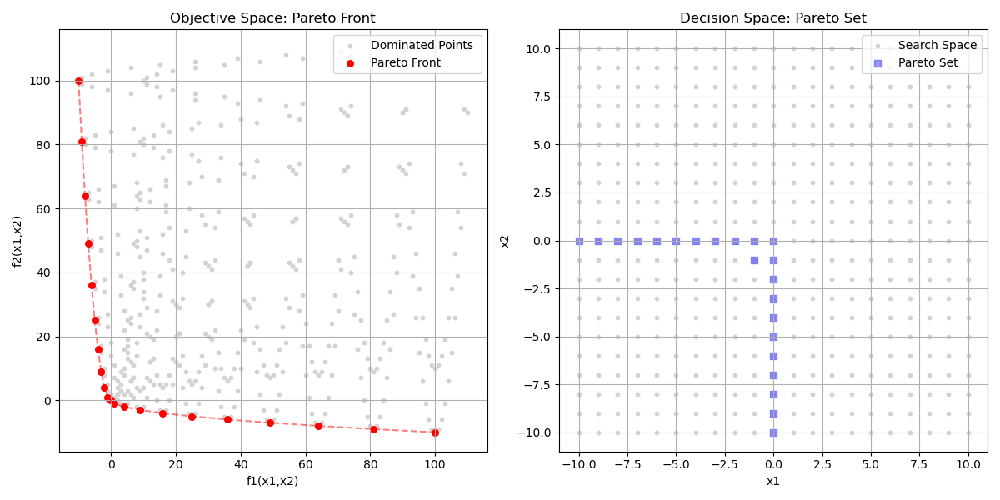

# Adaptive Hill Climbing (Ackley)

n this exercise I use adaptive hill climbing on the Ackley function to study how the mutation rate and the problem dimension affect the algorithm’s performance.

- For the 2D Ackley function (part a), I run 20 Monte Carlo simulations with 1,000 generations each, for 10 different mutation rates ($p_m = k/10$; $k=1,\dots,10$).
  - I record the best (minimum) function value from each run and compute the average over the 20 simulations.
    The goal is to discover how the mutation rate influences the quality of the final solution and to identify which ($p_m$) gives the best average performance.

## 2D ackley function

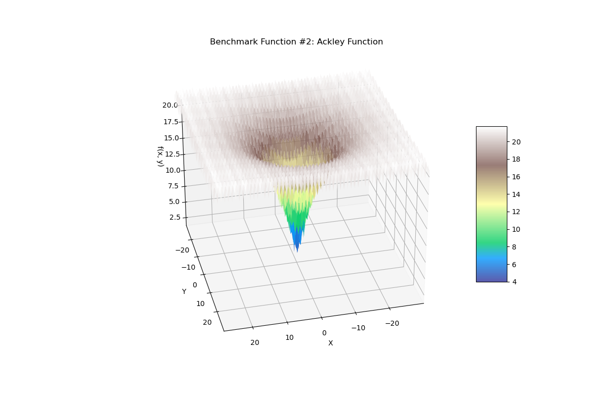

Following are the results obtained on 3 different runs.

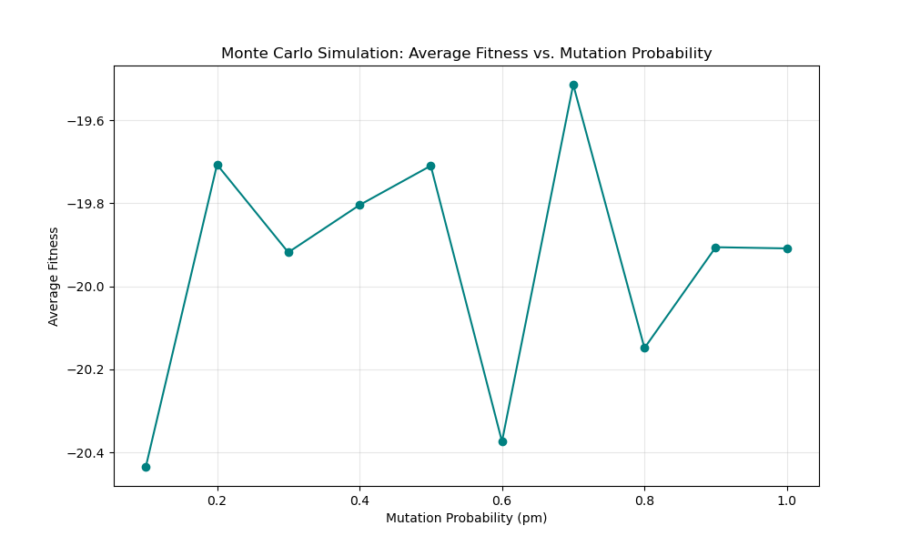
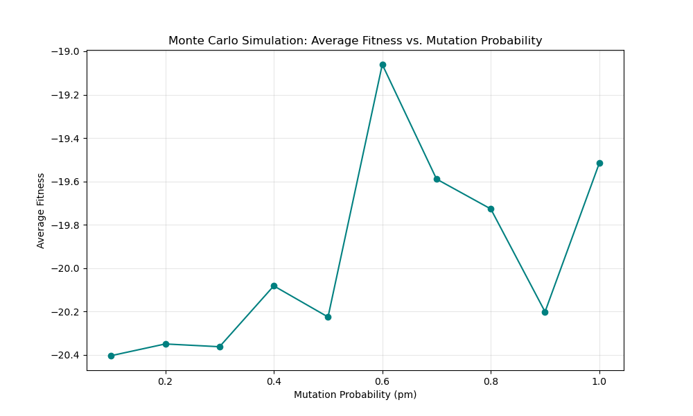
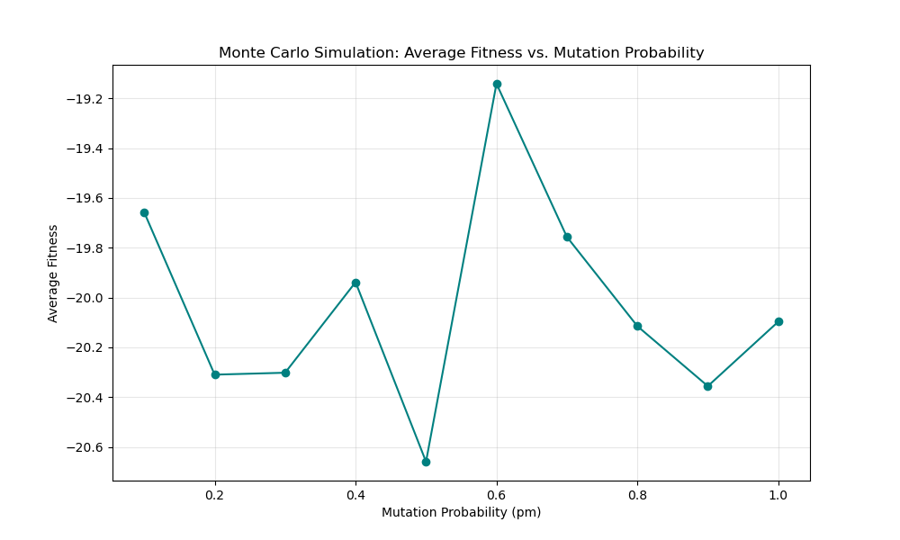

Now I've increased number of monte carlo simulations upto 100.

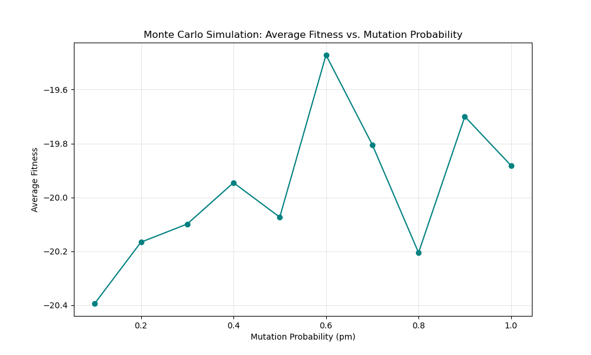
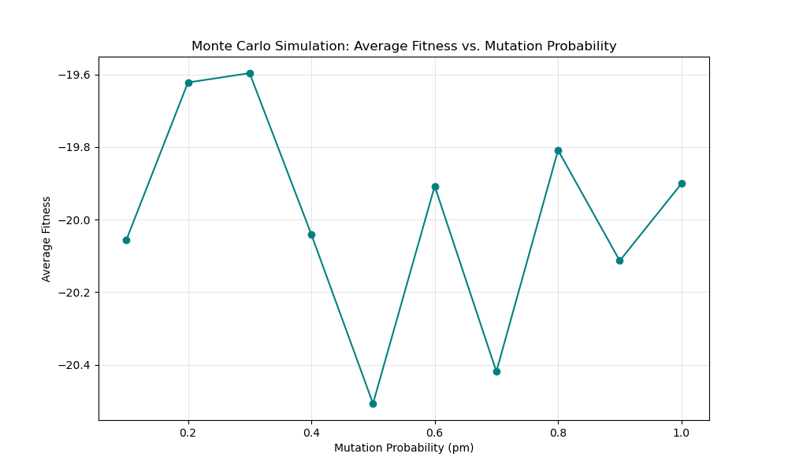
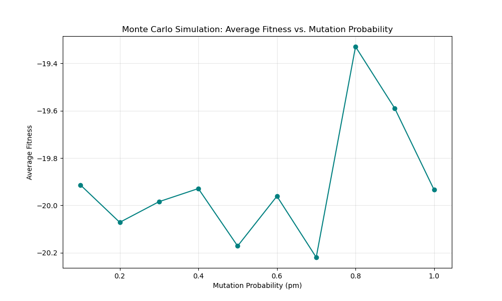

Now even more ! upto 1000.

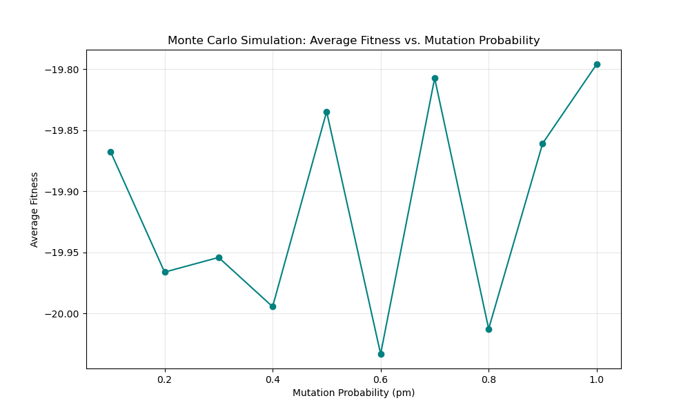
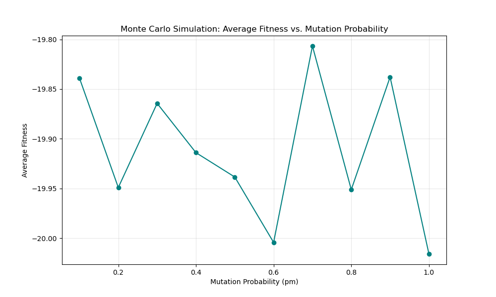

- In part (b), I repeat exactly the same set of experiments to see how stable the results are.
  By comparing the two tables of average minima, I’m investigating how much variability comes from the stochastic nature of the algorithm and how many Monte Carlo runs are needed to obtain reproducible, reliable estimates of performance.

- In part (c), I repeat the analysis from part (a) on the 10D Ackley function.
  Here the aim is to understand how the optimal mutation rate changes when the dimensionality of the search space increases.
  I want to see whether higher-dimensional problems require systematically different mutation rates (e.g., larger or smaller (p_m)) to balance exploration and exploitation effectively.

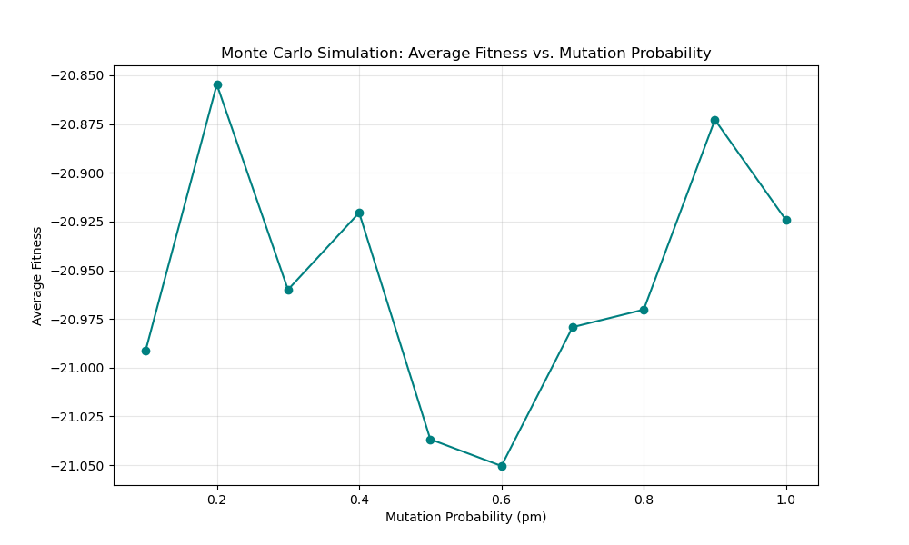
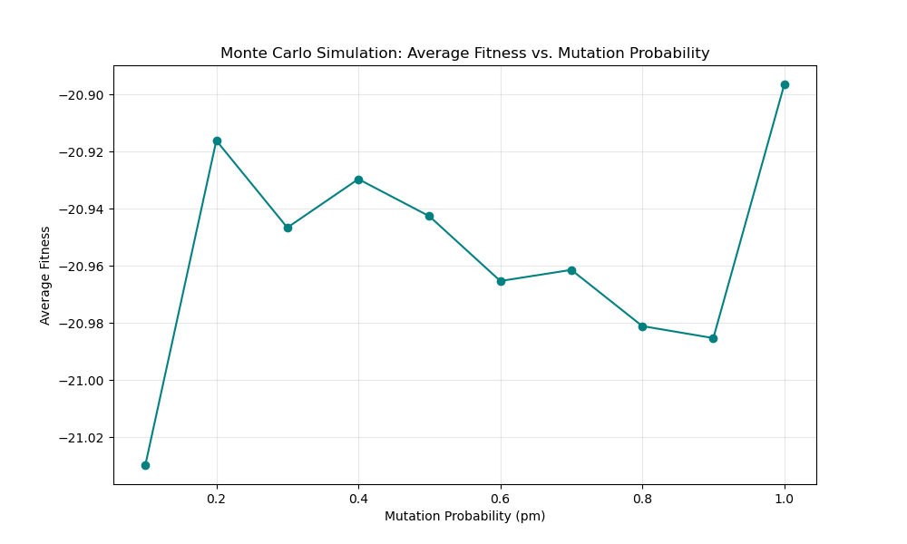

When I've moved upto 10 dimentions I can see the optimal mutation rate has significantly differed from that for 2 dimentions.
I couldn't figure out the exact numerical for reproducible results, but clearly these results are stochastic.
